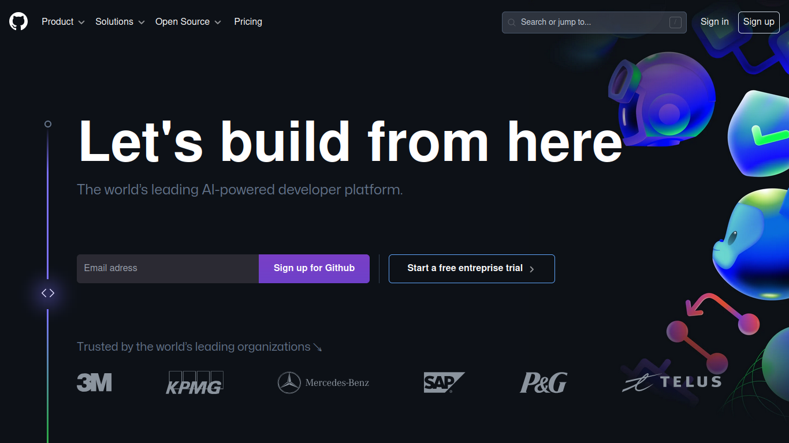

# Github welcome page



This project was the fifth frontend competition during a hackathon known as "Weekly December" organized by [GDG on Campus ISPM](https://gdg.community.dev/gdg-on-campus-institut-superieur-polytechnique-de-madagascar-antananarivo-madagascar/) on December 2023. And we are thrilled to clue you in that we were the winner.

## Table of contents
- [Introduction](#introduction)
- [Rules of the hackaton](#rules)
- [Installation](#installation)

## Introduction
The purpose was to build the github welcome page in less than 48 hours. Github has updated its welcome page so it's currently an old version. Here is the outcome of this repository: https://nick-kevin.github.io/WEEKLY_DECEMBER_FRONT_5/.

## Rules
Here are the rules during the competition:
#### Fidelity to the Mockup (20 points)
Deduct 1 point for each notable inconsistency with the mockup.
#### Compliance with W3C Standards (20 points)
The jury used validator.w3.org and compute an average score.
#### Responsiveness (20 points)
. The provided mockups are not responsive, so it is up to the participants to create a responsive preview.  
. Deduct 1 point for each notable flaw or inconsistency (e.g., spacing issues, horizontal scrolling, navbar problems, click issues, etc.).
#### Compatibility (20 points)
. The jury tested our outcomes on Google Chrome, Brave, Firefox, and Microsoft Edge.
. For each browser where it does not function properly, deduct 5 points.
#### Performance (20 points)
Performance was measured using “Lighthouse” on Google Chrome, and points were be awarded based on the results of this performance test.
#### Bonus Points
Bonus points were awarded for the lightest projects and for the animations.

## Installation
1. Clone the repository:
```bash
   git clone https://github.com/Nick-Kevin/WEEKLY_DECEMBER_FRONT_5.git
```

2. Enter in the folder:
```bash
   cd WEEKLY_DECEMBER_FRONT_5
```

3. Install all dependencies:
```bash
   npm install
```

4. Run the project:
```bash
   npm run dev
```
Then, open your browser at http://localhost:5173/WEEKLY_DECEMBER_FRONT_5 to see the website in action.